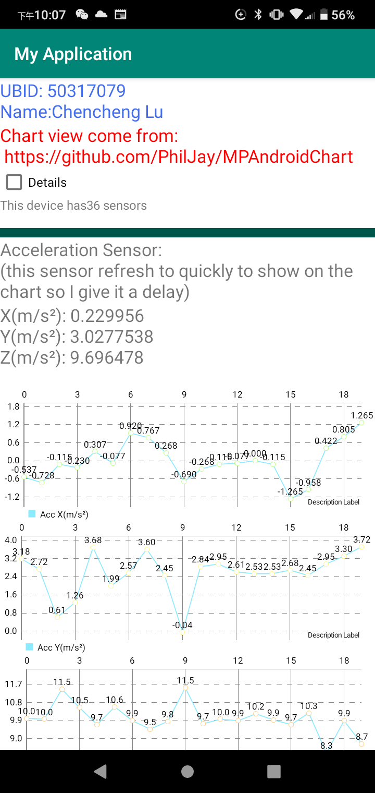

# GetSensorData
examples of getting sensor data on an Andriod phone

Total Sensors: 5 +Bettary Manager

All codes in: 50317079_Lu\app\src\main\java\com\example\myapplication\MainActivity.java

View file: 50317079_Lu\app\src\main\res\layout\activity_main.xml

!!!!!Notice: Chartview lib comes from: https://github.com/PhilJay/MPAndroidChart

The APP_Screenshot.png shows how the APP works.

